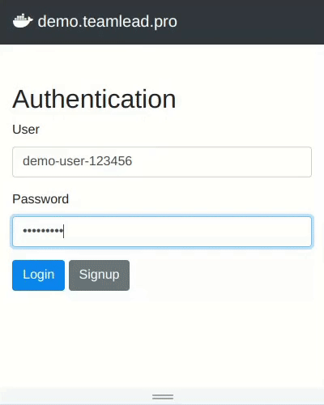
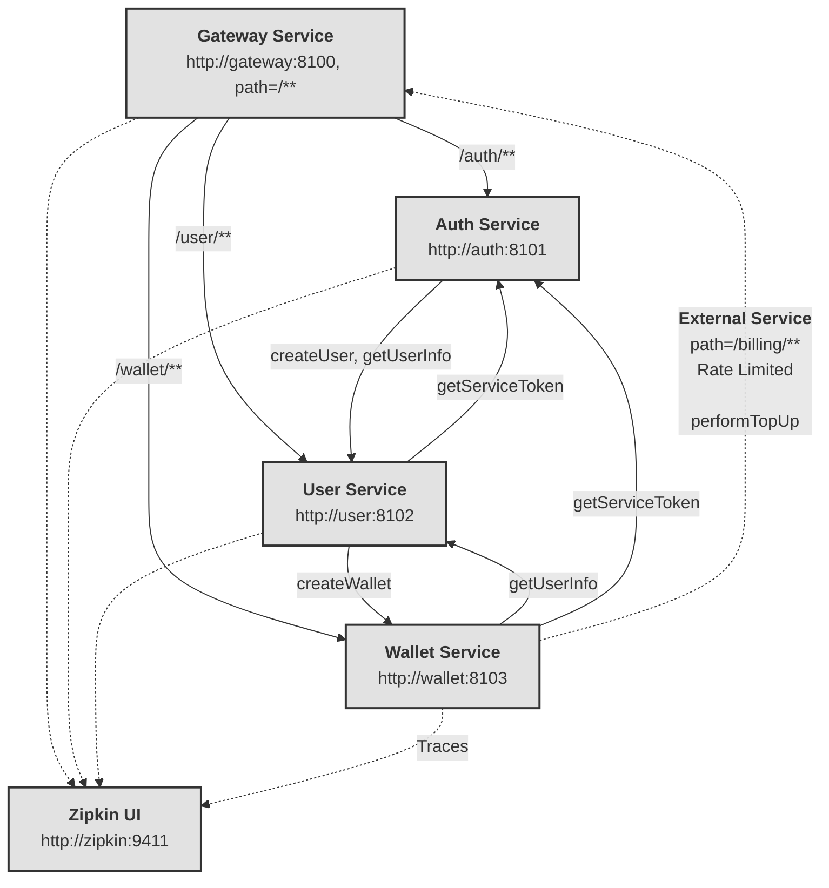
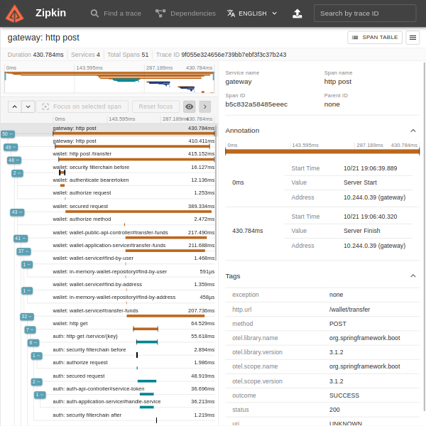
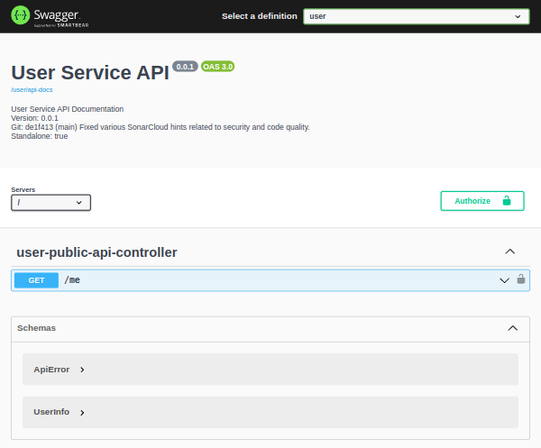

# Microservices with Spring Boot and Spring Cloud on Kubernetes Demo Project — KubePay

[](https://sonarcloud.io/summary/new_code?id=teamlead_spring-microservices-kubernetes-demo)
[](https://sonarcloud.io/summary/new_code?id=teamlead_spring-microservices-kubernetes-demo)
[](https://sonarcloud.io/summary/new_code?id=teamlead_spring-microservices-kubernetes-demo)
[](https://sonarcloud.io/summary/new_code?id=teamlead_spring-microservices-kubernetes-demo)
[](https://sonarcloud.io/summary/new_code?id=teamlead_spring-microservices-kubernetes-demo)
[](https://sonarcloud.io/summary/new_code?id=teamlead_spring-microservices-kubernetes-demo)

## Overview
This project is a demonstration of a simple financial system where users can:
- Register
- Login
- Top up balance
- Transfer funds to other users



*Screencast demonstrating the user story of transfer funds.*

## Technology Stack and Patterns
- Java 17+
- Spring Boot 3.2.0 , Spring Cloud 2023.0.0
- Wiremock, JUnit, Integration Tests
- Kubernetes, Minikube, Docker
- Microservice Architecture, Value Objects, DDD, DDT
- Zipkin, Logbook, Micrometer, Swagger/OpenAPI doc
- Spring Cloud Gateway, OpenFeign and many more

## Architecture

This project employs a microservices architecture containerized within Kubernetes (k8s). The core services — Gateway, Auth, User, and Wallet — interact with each other to fulfill various functionalities. All services are instrumented to send trace data to Zipkin for distributed tracing and monitoring.

The following graph illustrates the architecture described above.



## Project Structure
This project is a multi-module Java Spring Maven project structured as follows:

- **root**
  - gateway *(Public entry point for users. Handles API requests, proxies to upstream services, handles static files.)*
  - common *(Contains common functionalities shared across services.)*
  - auth *(Handles authentication and authorization.)*
  - user *(Handles user-related operations.)*
  - wallet *(Handles wallet and fund operations.)*

## Concepts

### Service Module Structure

Each service module in the system is divided into specific sub-modules to segregate the concerns and functionalities.

**Auth Module**
- **auth-sdk**: SDK for integrating authentication functionalities in other modules or services.
- **auth-api**: Contains the API interfaces and definitions for authentication.
- **auth-client**: Feign client for making remote calls related to authentication.
- **auth-service**: The core implementation of authentication operations as runnable Spring Application.

**User Module**
- **user-api**: Contains the API interfaces and definitions for user-related operations.
- **user-client**: Feign client for making remote calls related to user operations.
- **user-service**: The core implementation of user operations: get user info, create user.

**Wallet Module**
- **wallet-api**: Contains the API interfaces and definitions for wallet and financial transactions.
- **wallet-client**: Feign client for making remote calls related to wallet operations.
- **wallet-service**: The core implementation of wallet operations: create wallet, top-up, transfer funds.

Each module has its own version, which is managed as a Maven variable. This ensures consistent versioning across the modules and eliminates the need to manually update the libraries throughout the project.

### Public and Service API

In this architecture, I make a clear distinction between two types of APIs:

1. **Public APIs**: These are interfaces exposed to the end-users or external systems. They are marked with the `@PublicApi` annotation.

2. **Service APIs**: Used for inter-service communication within our system. They are annotated with `@ServiceApi`.

Let's dive deeper:

```java
@PublicApi
public interface UserPublicApi {
    
    @GetMapping(GET_USER_INFO)
    UserInfo getUserInfo(@JwtPrincipal UserPrincipal user);
}

@ServiceApi
public interface UserServiceApi {
    
    @PostMapping(CREATE_USER)
    UserInfo createUser(@JwtPrincipal ServicePrincipal service,
                        @Validated @RequestBody CreateUserRequest request);
}
```
Here, the `UserPublicApi` exposes a public endpoint for fetching user information, while the `UserServiceApi` is more internal and is meant for creating a user.

Controllers implementing these interfaces:

```java
@PublicApiController
public class UserPublicApiController implements UserPublicApi {

    @Override
    public UserInfo getMyInfo(@JwtPrincipal UserPrincipal user) {
        return userApplicationService.getUserInfo(user);
    }
}

@ServiceApiController
public class UserServiceApiController implements UserServiceApi {

    @Override
    @CanCreateUser
    public UserInfo createUser(@JwtPrincipal ServicePrincipal service,
                               @Validated @RequestBody CreateUserRequest request) {
        return userApplicationService.createUser(request);
    }
}
```

The `@PublicApiController` and `@ServiceApiController` annotations denote the respective controllers handling the public and service requests. Notice the usage of the `@CanCreateUser` authority. It ensures that only services with the specific permission (determined by the presence of the authority in the `@JwtPrincipal`) can execute the createUser method.

In our design, service clients implement the same interfaces as our controllers (e.g. UserPublicApi and UserServiceApi), enhancing consistency and clarity.
```java
@FeignClient(...)
public interface UserClient extends UserPublicApi, UserServiceApi {

}
```

This uniformity offers not only a cleaner and organized codebase but also:

- Type Safety: By adhering to a predefined contract, we ensure that both the caller and the callee are in sync, minimizing runtime errors.
- DRY (Don't Repeat Yourself): This approach reduces redundancy. The same interface definitions are reused across the board, eliminating the need to define and maintain parallel structures.
- Maintainability: Changes in the interface will automatically be reflected in both the service and the client, ensuring uniform updates and reducing the chances of oversight.

### Authentication, Authorization and Exceptions

In other service components, when consuming the user API module, it's crucial to handle exceptions appropriately:

```java
@Service
public class SomeOtherService {

    @Autowired
    private ServicePrincipal servicePrincipal;

    @Autowired
    private UserClient userClient;
    
    private boolean isUserEnabled(String user) {
        try {
            return userClient.getUserInfo(servicePrincipal, user) // Inter-JVM call
                    .isEnabled();
        } catch (UserNotFoundException e) {
            return false;
        } catch (Exception e) {
            // other error handling logic...
        }
    }
}
```


This ensures resilience in the system. For instance, if a user isn't found (`UserNotFoundException`), this specific scenario is gracefully managed by returning false.

In the above component, `ServicePrincipal` is representing the identity of a service within the system and contains credentials or claims that verify its authenticity and permissions.

Before making the `userClient.getUserInfo` call, the service will fetch a short-lived JWT token. This is done by reaching out to the authentication service, providing its secret or credentials. This JWT token embodies the appropriate permissions and roles for the service, granting it access to specific operations.

Both authentication and authorization exist for users and services. Roles and permissions are clearly defined, and every service/user possesses a JWT token issued by auth-service.

### Error Handling and Tracing


To provide a consistent experience and aid debugging, all errors emanating from our services are rendered into a standardized format. Regardless of which service the error originates from, the client (be it a web browser, JS application, etc.) will always receive a response in the following structure:

```json
{
  "message": "Descriptive error message here",
  "type": "ERROR_TYPE_HERE"
}
```

For instance, an error response indicating a missing wallet would look like:

```json
{
  "message": "Recipient's wallet not found",
  "type": "WALLET_NOT_FOUND"
}
```

To get a comprehensive view of how requests traverse through microservices, the project uses `micrometer` and `opentelemetry-exporter-zipkin` for tracing. With this, you can visualize and trace the entire path of requests, from their entry points down to the deepest service calls.

You can delve deep into request traces, latencies, dependencies and exceptions all visualized in the Zipkin dashboard.



To use Zipkin and see traces, navigate to the Zipkin dashboard, select the service of interest, and dive deep into the request paths.

### Data-Driven Integration Tests

Data-driven testing allows you to execute the same test case using multiple input values and expected results. By providing different sets of data, you can validate how the system behaves under various scenarios without writing multiple test cases.

In the example below, I demonstrate a data-driven approach for integration testing:

```java
@TestCase({
    "integration/public-api/wallet-top-up/success/request.json",
    "integration/public-api/wallet-top-up/success/response.json", 
    "integration/public-api/wallet-top-up/success/mock.json",
})
public void whenTopUpRequested_thenWalletBalanceIncreases(String request, String response, String mock) {
    
    // Mock external service calls
    wireMockServer.stubFor(WireMock.get(WireMock.anyUrl())
            .willReturn(WireMock.ok()
                    .withBody(mock)
                    .withHeader(HttpHeaders.CONTENT_TYPE, MediaType.APPLICATION_JSON_VALUE)));
    // Perform API request and validate response
    mockMvc.perform(post(WALLET_TOP_UP)
                    .header(HttpHeaders.AUTHORIZATION, userToken())
                    .content(request)
                    .contentType(MediaType.APPLICATION_JSON))
            .andExpect(status().isOk())
            .andExpect(MockMvcResultMatchers.content().json(response));
}
```

This code provides a glimpse into our integration test structure:

- `@TestCase` Annotation: Defines paths to the mock data, request, and expected response files.
- `WireMock`: A tool that allows you to stub out external service calls, ensuring the test remains isolated.
- `MockMvc`: Facilitates testing of Spring MVC layers, ensuring accurate HTTP requests and responses.

By employing a data-driven approach, we streamline our testing process, making it more efficient and comprehensive.

For enhancing the realism and reliability of these tests, I highly recommend integrating [testcontainers](https://java.testcontainers.org/) and [database-rider](https://github.com/database-rider/database-rider):

```java
@DataSet("integration/public-api/wallet-top-up/success/dataset.json")
@ExpectedDataSet("integration/public-api/wallet-top-up/success/expected-dataset.json")
@TestCase({
    "integration/public-api/wallet-top-up/success/request.json",
    "integration/public-api/wallet-top-up/success/response.json",
    "integration/public-api/wallet-top-up/success/mock.json",        
})
public void whenTopUpRequested_thenWalletBalanceIncreases(...)
```

While this project doesn't demonstrate the usage of any database for simplicity, I'll reference another demo project that delves deeply into that technique.

### Swagger / OpenAPI / OAS 3.0 Docs

Project's API documentation, powered by OpenAPI Specification (OAS) 3.0, offers an interactive UI to explore various service endpoints. Select your desired service from the top-right, and note that for security, only the `@PublicApiController` spec is visible by default. Relevant Git and build details are also provided for your reference.



To visit the docs, navigate to `/swagger-ui` in any service, e.g. http://localhost:8100/swagger-ui.

## Building & Running

This project is structured as a multi-module Spring project. Before getting started, ensure that you have Java 17 or higher [installed](https://www.java.com/en/download/help/download_options.html) on your machine.

### Install dependencies

Maven is wrapped in this project, ensuring you use the correct version without needing a separate installation. To install dependencies, run:

```bash
./mvnw clean install -DskipTests
```

This command utilizes the Maven Wrapper script, which will automatically download the correct Maven version if it's not present on your system, and then proceed to clean the project and install the dependencies. This approach keeps the setup consistent across all environments.

### Running Locally

1. Navigate to the root directory of the project.

2. Run the following command to start the services:

```bash
./bin/run-all.sh
```

After the services have started, visit http://localhost:8100 in your browser.

Alternatively, if you wish to start services manually, you can navigate to each module's directory and start it using the bundled Maven. For example, to run the gateway service:

```bash
cd ./gateway/gateway-service
./../../mvnw spring-boot:run
```

Or

```bash
java -jar ./gateway/gateway-service/target/*.jar
```

List of available modules to run:

- `gateway/gateway-service`
- `auth/auth-service`
- `user/user-service`
- `wallet/wallet-service`

### Using Docker Compose

Docker files have been provided for each module. Firstly, you need to build the Docker images:

```bash
./mvnw clean install -DskipTests
docker build -t kubepay.gateway:latest ./gateway/gateway-service
docker build -t kubepay.auth:latest ./auth/auth-service
docker build -t kubepay.user:latest ./user/user-service
docker build -t kubepay.wallet:latest ./wallet/wallet-service
```

With the images built, you can then use Docker Compose to orchestrate the containers. Make sure you're in the directory containing the docker-compose.yml and .env files:

```bash
docker-compose up
```

After the services have started, visit http://localhost:8100 in your browser.

Additionally, to view tracing information, you can access the Zipkin UI by navigating to http://localhost:9411 in your browser.

### Using Minikube

To deploy the services on Minikube:

Start Minikube:

```bash
minikube start
```

Set your current terminal's Docker environment to Minikube's Docker:

```bash
eval $(minikube docker-env)
```

Rebuild the Docker images while pointing to Minikube's Docker daemon:

```bash
./mvnw clean install -DskipTests
docker build -t kubepay.gateway:latest ./gateway/gateway-service
docker build -t kubepay.auth:latest ./auth/auth-service
docker build -t kubepay.user:latest ./user/user-service
docker build -t kubepay.wallet:latest ./wallet/wallet-service
```

Apply the Kubernetes configurations:

```bash
kubectl apply -f ./k8s/configmap.yml
kubectl apply -f ./k8s/zipkin-service.yml
kubectl apply -f ./k8s/gateway-service.yml
kubectl apply -f ./k8s/auth-service.yml
kubectl apply -f ./k8s/user-service.yml
kubectl apply -f ./k8s/wallet-service.yml
```

Once the services are up and running in Minikube, you can obtain the URL for a specific service using the following command:

```bash
minikube service <service-name> --url
```

You can directly open it in your browser to access the demo:

```bash
open $(minikube service gateway --url)
```

Additionally, to view tracing information, you can access the Zipkin UI. You can get the Zipkin URL by running:

```bash
minikube service zipkin --url
```

To monitor the services on Minikube:

```bash
minikube dashboard
```

## Contributing

Thank you for considering a contribution to this project! I appreciate any help in bringing my plans to fruition. Here's a brief outline of the features and configurations I'm hoping to implement:

- **Code Quality & Styling Tools**: Setting up PMD, Checkstyle, and Codeformatter to maintain code consistency and quality.
- **Data Storage**: Integrating PostgreSQL as the primary data storage solution.
- **User Notifications**: Implementing Kafka and WebSockets for real-time user notifications.
- **Code Coverage**: Achieving full test coverage for all modules and functionalities.
- **Health Checks & Deployment Strategies**: Implement health checks, liveness, and readiness probes, along with blue-green deployment strategies. This ensures high availability and minimal downtime during application updates.
- **Token Management**: Incorporate a robust token management system using refresh tokens and access tokens for users. This enhances security and user session management in the application.
- **Deployment & Scaling**: Configuring ingress for Kubernetes (k8s) to ensure smooth deployment and scalability.
- **Transport Layer Security**: Implement service mesh (e.g. Istio) or mTLS to ensure encrypted and authenticated communication between microservices.
- **Configuration and Secret Storage**: Implement HashiCorp Vault for managing configurations and securely storing secrets.
- **User Balance Storage**: Utilize `javax.money` for the storage and management of user balances.
- **Front-end Development**: Set up a separate folder dedicated to building a front end using a popular framework (e.g., React or Vue).
- **Educational Gradle Configuration**: Integrate a Gradle configuration for educational purposes.
- **Testing Infrastructure**: Utilize TestContainers and DB-Runner for improved testing, especially for database interactions and integration tests.
- **Logs, Traces, Metrics**: Implement Grafana, Loki, Tempo, Logback for better logging and tracing. 

### Steps to Contribute:

- **Fork the Repository**: Begin by forking this repository to your GitHub account.
- **Clone Your Fork**: Once you've forked the repository, clone it to your local machine to start working on the enhancements.
- **Create a New Branch**: Always create a new branch for each feature or fix. This helps in ensuring that the master branch remains stable.
- **Work on the Feature or Fix**: Use your cloned fork to work on the tasks mentioned above or any other improvements you see fit.
- **Commit and Push**: Once you're done, commit your changes and push them to your forked repository.
- **Open a Pull Request**: Return to this repository and open a new pull request. In the PR description, be sure to describe your changes and link any relevant issues.
- **Code Review**: I will review your PR. I might suggest changes or improvements. If changes are requested, please address them to get your PR merged.
- **Merge**: Once everything looks good, your PR will be merged into the main codebase!

### Best Practices:

- Please ensure that your code adheres to the code quality standards before submitting a PR.
- Always write tests for any new feature or bug fix to ensure the functionality works as expected and maintains the project's quality standards.
- If you're unsure about any feature or need guidance, don't hesitate to open an issue or reach out for clarification.

Together, we can achieve this project's goals and ensure it stands out in terms of quality and functionality. Happy coding!

## License

This program is free software: you can redistribute it and/or modify
it under the terms of the GNU General Public License as published by
the Free Software Foundation, either version 3 of the License, or
(at your option) any later version.

This program is distributed in the hope that it will be useful,
but WITHOUT ANY WARRANTY; without even the implied warranty of
MERCHANTABILITY or FITNESS FOR A PARTICULAR PURPOSE.  See the
GNU General Public License for more details.

You should have received a copy of the GNU General Public License
along with this program.  If not, see <https://www.gnu.org/licenses/>.
